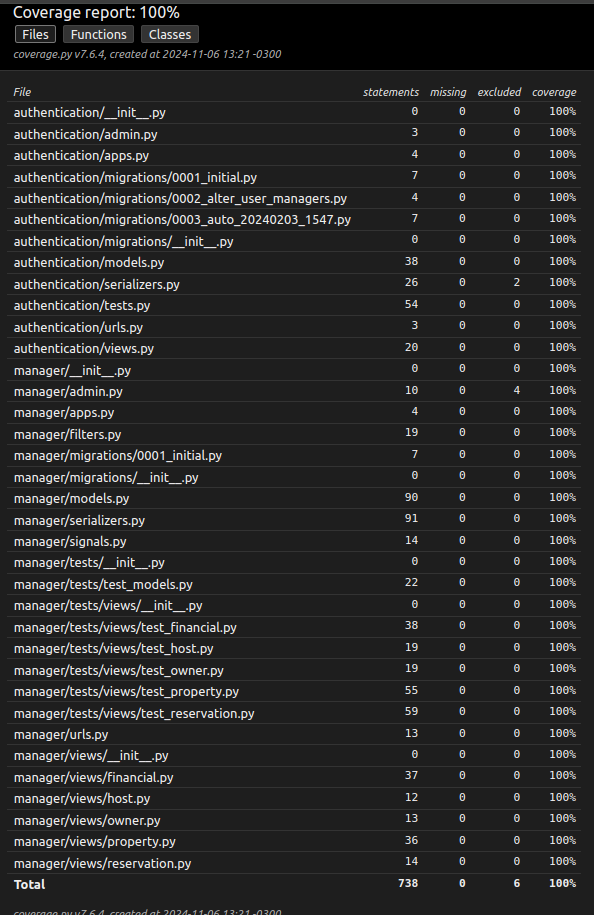

### Property Rental System RestAPI
**Abordagem:** 

Utilizado o Django Rest Framework para a criação de um sistema de aluguel.

Utilizei uma estrutura base minha para realizar o desenvolvimento do projeto.

### Exemplos de Requisições 

- **POST /properties - Criar uma propriedade** 
```
{ 
    "title": "Casa de Férias Algarve", 
    "address_street": "Av Github", 
    "address_number": "2024", 
    "address_neighborhood": "Jurerê", 
    "address_city": "Florianópolis", 
    "address_state": "SC", 
    "country": "BRA", 
    "rooms": 3, 
    "capacity": 3, 
    "price_per_night": 120.00, 
    "owner_id": 1, 
    "host_id": 1, 
    "seazone_commission” 0.20, 
    "host_commission” 0.10, 
    "owner_commission” 0.70, 
} 
```

- **POST /reservations - Criar uma reserva** 
```
{ 
    "property_id": 1, 
    "client_name": "John Doe", 
    "client_email": "johndoe@example.com", 
    "start_date": "2024-12-20", 
    "end_date": "2024-12-25", 
    "guests_quantity": 2 
} 
```

- **GET /reservations - Buscar uma reservas** 
```
...
results: [ 
    { 
        "reservation_id": 1, 
        "property": {Property object}, 
        "owner": {Owner object}, 
        "host": {Host object}, 
        "property": {property object}, 
        "client_name": "John Doe", 
        "client_email": "johndoe@example.com", 
        "start_date": "2024-12-20", 
        "end_date": "2024-12-25", 
        "guests_quantity": 2, 
        "total_price": 1000.0, 
        "seazone_commission": 200.0, 
        "host_commission": 100.0, 
        "owner_commission": 700.0, 
    }, 
] 
...
```

- **GET /properties/availability?property_id=1&start_date=2024-12-20&end_date=2024-12-27&guests_quantity=4  - Buscar disponibilidade** 
```
Status: 200 Disponivel
Status: 400 Não disponivel
Status: 404 Não encontrada propriedade
```

- **GET /financial/commissions?type=seazone&month=10&year=2024 - Buscar comissões** 
```
{ 
    "total_commission": 5000.0, 
    "total_reservations": 5, 
    "properties_statement": [ 
        { 
            "property_id": 1, 
            "total_commission": 2000.0, 
            "total_reservations": 2, 
        }, 
        { 
            "property_id": 2, 
            "total_commission": 3000.0, 
            "total_reservations": 3, 
        }, 
    ], 
}

```


### Run in:
```
http://localhost:8000/docs/
```


### Docker PostgreSQL:
```
You need to create .env like .env_postgresql file

sudo docker-compose -f docker-compose-postgresql.yml up

sudo docker-compose -f docker-compose-postgresql.yml down
```

### Docker SQLite3:
```
You need to create .env like .env_sqlite file

sudo docker-compose -f docker-compose-sqlite.yml up

sudo docker-compose -f docker-compose-postgresql.yml down
```


### Kill dockers:
```
docker rm -f $(docker ps -a -q)
```


### Configurations .env: 
```
Copy .env.example to .env
Set your environment variables on .env file
Use variables with the same names as you use when creating the database
```


### Environment: 
Python Version 3.13.0 e Django 5.1.3
```
python3 -m venv venv 
OR
virtualenv --python=python3 venv

source venv/bin/activate

cd django/
```


### Database - POSTGRES (Linux): 
```
sudo -i -u postgres
psql
CREATE USER user_default WITH PASSWORD 'password_default';
ALTER USER user_default CREATEDB;
CREATE DATABASE database_default;
ALTER DATABASE database_default OWNER TO user_default;
CREATE EXTENSION pg_trgm;
```


### Requirements: 
```
# Install requirements
pip install -r requirements.txt

# Freeze requirements
pip freeze > requirements.in

# Compile requirements
pip-compile requirements.in
```


### Migration: 
```
python manage.py migrate
```


### Collect Staticfiles: 
```
python manage.py collectstatic   
```


### Run: 
```
python manage.py runserver
```


### Documentation: 
```
/docs
/docs/redoc
```


### Create User and Access Token in API: 
```
Use endpoint /auth/signup/ 
Before use /auth/jwt/create/ 

Now you have your access_token and refresh_token
```


### Use Authenticate Token: 
```
Bearer {access_token}
```


### Create Super User / Login: 
```
python manage.py createsuperuser 

To login use email and password

Already have a super user in database: admin@admin.com / admin
```


### Unit Tests: 
```
python manage.py test --failfast manager
```


### Unit Tests Report HTML: 
```
coverage run --source='./manager' manage.py test
coverage report

coverage html
HTML report: django/htmlcov/index.html
```


### Coverage: 



### New translations:
```
python manage.py makemessages --locale pt_BR

Change to pt-br on settings:
LANGUAGE_CODE= 'pt-BT'

Obs: If necessary translate to portuguese.
```


### Debug and traceback:
```
Need to set DEBUG=True in .env file

Need to set ENVIRONMENT_MODE=dev in .env file
```

## Copyright and license

Code released under the [freeBSD License](https://github.com/Henriquejdc/BankManager/blob/master/LICENSE.md).
